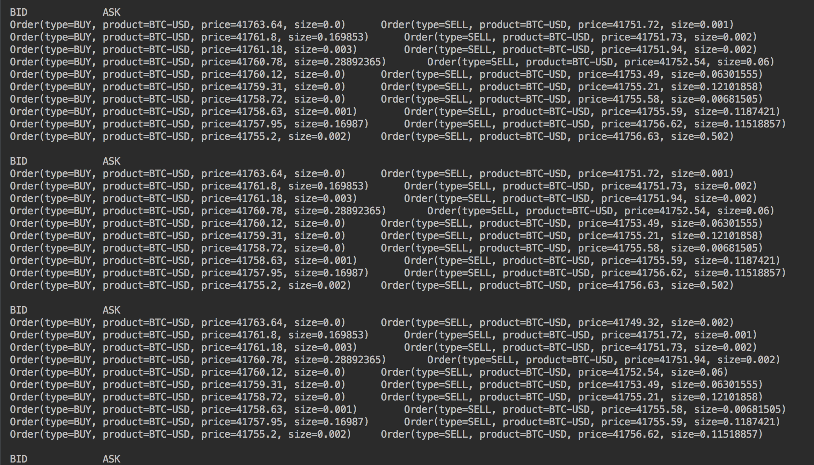
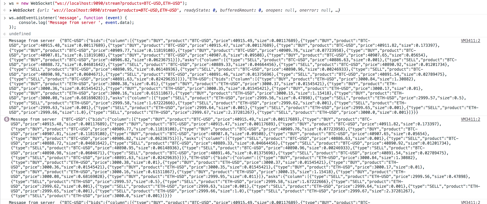

# fuzzy-computing-machine

A crypto exchange connectivity suite of applications.

This suite of applications receives live order updates from Coinbase's exchange and streams it back to users as an order book.


## Run Me

The application can be run as either a CLI or a web server.

### Run CLI

Compile the source code and run the com.btc.one.exchange.cli.Main class. You can provide a specific product that you would like to subscribe to exchange updates for as a program argument while running. eg:
```
com.btc.one.exchange.cli.Main BTC-USD
```
This will print the BTC-USD order book every time there is a new buy or sell BTC-USD order on the exchange. If you don't provide a product, you will be subscribed to ETH-USD updates by default.




### RUn Web Server

Compile the source code and run the com.btc.one.server.OrderStreamerService class. The server will start up on port 9090.

After the server starts up, you can stream updates on multiple products via a websocket connection at the address: ws://localhost:9090/stream. As a quick example, you can stream product order book updates from the Google Chrome console with this JavaScript snippet:
```
ws = new WebSocket("ws://localhost:9090/stream?products=BTC-USD,ETH-USD");
ws.addEventListener('message', function (event) {
    console.log('Message from server ', event.data);
    // This will print the state of the BTC-USD and ETH-USD whenever there is a new order for either.
});
```


